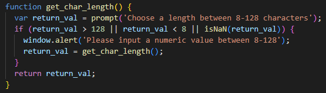
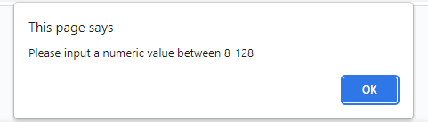

# Module 3 Password Generator

## Table of Contents
1. [Description](#description)
2. [Visuals](#visuals)

## Description
[Link to live site](https://nathanhawk2.github.io/js-pw-gen/)

Started out with two functions to ask all the prompts as seen in one of the screenshots. Used math functions to randomly pick all the possible characters. Prompts are used to figure out what parameters are needed by user for password.

## Visuals

This function was made to prompt the user to get a numeric value between 8-128. If anything is entered that is not in that value set, it will repeat until it is inputted correctly.

This is a photo of what is shown when the wrong value is inputted into the function above.